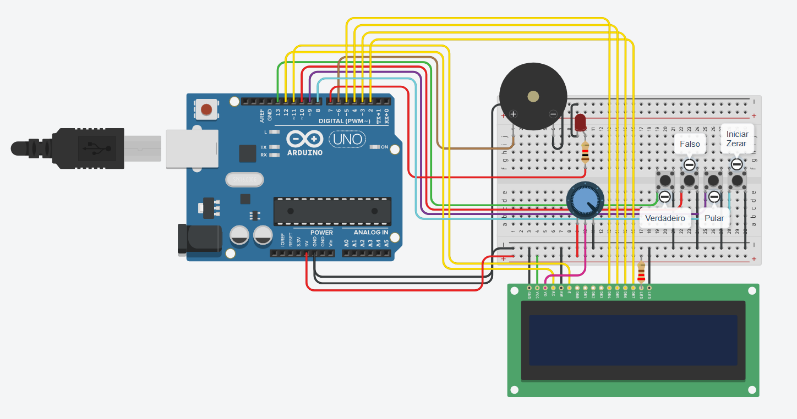

---------------------------------------------------- COMPUTAÇÃO MÓVEL - JOGO DO MILHÃO ----------------------------------------------------

- Introdução:
  
  Bem-vindo ao JOGO DO MILHÃO! Você está preparado para testar seus conhecimentos e habilidades neste jogo de perguntas eletrizante? Se sim, então você está prestes a embarcar em uma jornada emocionante!

  O desafio é simples, mas não se engane, pois a dificuldade está à altura do prêmio. Aqui está o que você precisa saber:
    1) O jogo consiste em 21 perguntas no total: 7 fáceis valendo 1 ponto cada, 7 médias valendo 2 pontos cada e 7 difíceis valendo 3 pontos cada.
    2) A cada jogo, serão selecionadas aleatoriamente 15 perguntas de qualquer nível de dificuldade.
    3) Você terá à disposição 3 pulos que podem ser usados a qualquer momento durante o jogo.
    4) Cada pergunta terá um tempo limite de 15 segundos para ser respondida. Se o tempo se esgotar, você perderá um dos seus pulos. E lembre-se, se todos os pulos forem usados, o jogo acaba!
    5) Se errar qualquer pergunta, o jogo será encerrado e sua pontuação será exibida. Mas não se preocupe, você pode sempre tentar novamente e superar seu próprio recorde.

  Agora é hora de provar sua inteligência e habilidade. Está pronto para o desafio? Então, boa sorte e que a jornada rumo ao prêmio milionário comece agora!

- Metodologia:

  1) Plataforma de desenvolvimento: TinkerCad
  2) Linguagem utilizada: C++
  3) Microcontrolador: Arduino Uno
  4) Placa de circuito para montagem do projeto
  5) Cabos e resistores, conforme necessário para conexões e limitação de corrente
  6) LED para indicar quando o tempo está acabando
  7) Display LCD para exibir o programa, pontuações e mensagens do jogo
  8) Buzzer para reproduzir músicas e sons para cada ação dentro do jogo
  9) Botões para interação do jogador, como responder perguntas e acionar os pulos
  10) Potenciômetro para ajustar o contraste ou brilho do Display LCD

- Código:

  O código está no arquivo 'program.ino', totalmente comentado e explicado.

- Vídeos e imagens do projeto:

  1) O vídeo do projeto em funcionamento está no arquivo 'Projeto Montado.mp4'.
  2) A imagem 'system.png' é uma print do sistema montado no TinkerCad.
  
  
  
  (Projeto Montado.mp4)

- Conclusão:

  Para realizar o programa, primeiro analisamos cada requisito do trabalho. Para fazer as questões, separamos elas em 3 listas diferentes, para separa-las por dificuldade, e mais 3 listas contendo a resposta de cada pergunta. 
  Após isso, fizemos para cada requisito uma função, para otimização do nosso jogo. 
  Separamos as funções da seguinte forma:

  1) uma função para cada menu
  2) "Mostrar pontuação"
  3) "Timer/Temporizador"
  4) "Pular questão"
  5) "Resetar variáveis iniciais"
  6) "Iniciar o jogo"
  7) "Finalizar o jogo"
  8) "Músicas e efeitos sonoros"
  9) "Mostrar as questões no LCD"
  10) "Pegar o peso da questão"
  11) "Pegar a resposta correta da questão"

  Durante o desenvolvimento, tivemos pequenos problemas em relação a analisar se o jogo estava em andamento ou não. Pois, sempre que apertávamos o botão, a função "Iniciar jogo" era chamada e as perguntas eram chamadas todas de uma vez sem a necessidade de uma ação do jogador.

  Descobrimos que a causa desse problema eram duas. Uma delas era o fato de termos criado uma função separada da função principal contendo a lógica do andamento do jogo. Na toria isso deveria funcionar, mas acreditamos que possa ser algum erro do TinkerCad, já que as funções "setup" e "loop" são programadas internamente no TinkerCad e não conseguimos editá-las. Para resolver isso, removemos a função do jogo e colocamos suas lógicas diretamente na função principal "loop", fazendo com que o andamento do jogo rodasse normalmente.

  O outro problema foi em relação a obter o estado do botão, pois estávamos capturando seu estado através de uma variável. Quando pressionávamos o botão, ele acabava entrando dentro de várias condições criadas dentro da função. Por exemplo: pressionamos o botão. Dentro da função principal, existem dois condicionais, um para se o botão se encontra pressionado e outro para que não. Por algum motivo, o programa entrava nas duas condicionais durante uma única execução, como se o estado do botão fosse alterado no meio da execução sem a chamada da variável. Acreditamos que isso também possa ser algum problema do TinkerCad, já que normalmente isso não ocorre. Para resolver isso, bastou removermos a variável e substiturimos a variável das condições pela própria função de captação do estado do botão.

  Outro problema que obtemos foi relacionado à parte de memória dentro do TinkerCad. A ideia inicial era fazer 20 perguntas por dificuldade, porém ficamos sem memória suficiente para deixá-las na memória do programa, e para realizar este trabalho não poderíamos colocá-las em nenhum meio externo. Por isso, tivemos que deixar apenas 7 perguntas para cada dificuldade.

  Contudo, o trabalhar proposto pelo Prof. Isaac Jesus foi feito corretamente dentro do que foi pedido à nós!

  Esperamos que gostem do nosso jogo, até breve!! 
  
